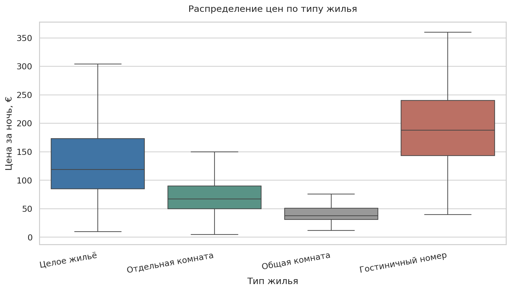
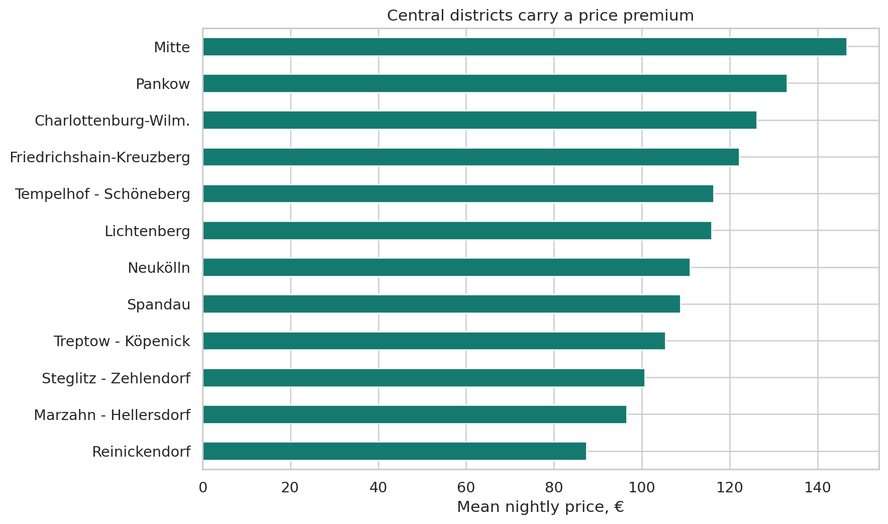
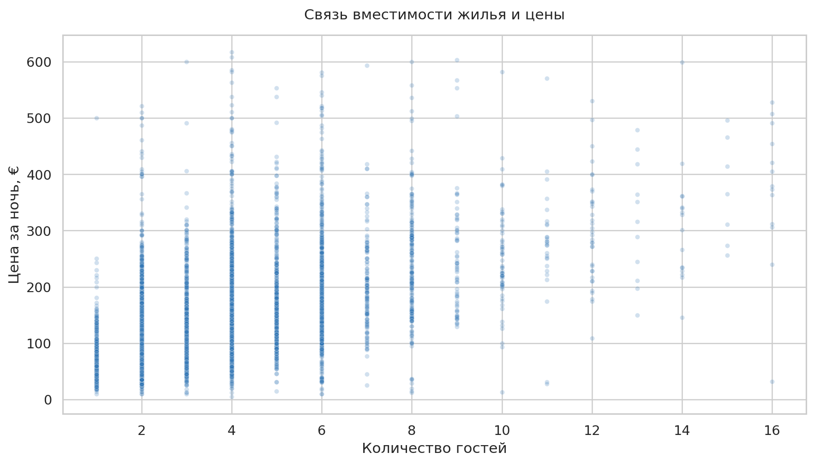
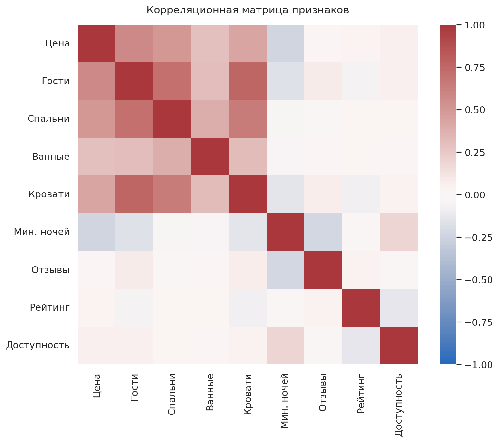

# Airbnb Berlin — факторы стоимости краткосрочной аренды

> Пет-проект по разведочному анализу данных: какие характеристики объявления Airbnb сильнее всего связаны со стоимостью ночи в Берлине.

**[Открыть ноутбук](./airbnb_berlin_eda.ipynb)** · **[Открыть презентацию](./airbnb_berlin_eda_presentation.pptx)**



## Задача

Превратить курсовую работу в воспроизводимый аналитический проект: очистить исходные данные, проверить гипотезы о факторах цены и показать результаты через понятные визуализации.

## Данные

- **Источник:** [Inside Airbnb — Berlin](https://insideairbnb.com/get-the-data/)
- **Срез:** 23 сентября 2025 года
- **Исходная выборка:** 14 274 объявления и 79 признаков
- **Рабочая выборка:** 9 171 объявление после обработки выбросов
- **Обработка цены:** удалены значения выше 99-го перцентиля — €617,37 за ночь

Исходный файл не добавлен в репозиторий. Ноутбук автоматически скачает точный срез данных при первом запуске.

## Что было сделано

1. Очищена переменная `price`: убраны символы валюты, значения приведены к числовому формату.
2. Снижено влияние аномально дорогих объектов: исключён верхний 1% цен.
3. Проведён EDA цены, типа жилья, района, вместимости, минимального срока бронирования и репутационных факторов.
4. Построены boxplot, столбчатые диаграммы, scatter plot и корреляционная матрица.
5. Проверены восемь гипотез о факторах ценообразования.

## Ключевые выводы

| Вывод | Подтверждение данными |
| --- | --- |
| **Тип жилья — один из ключевых факторов цены.** | В среднем hotel room стоит **€197** за ночь, entire home/apt — **€141**, private room — **€81**, shared room — **€48**. |
| **Центральные районы дороже.** | Средняя цена в Mitte — **€146,6**, в Reinickendorf — **€87,4**. |
| **Вместимость заметно связана с ценой.** | Корреляция `price` и `accommodates`: **0,59**. |
| **Длинный минимум проживания снижает цену за ночь.** | Корреляция `price` и `minimum_nights`: **−0,20**. |
| **Рейтинг сам по себе почти не объясняет цену.** | Корреляция `price` и `review_scores_rating`: **0,03**. |

## Визуализации

<p align="center">
  
  
</p>

<p align="center">
  
</p>

## Стек

`Python` · `pandas` · `NumPy` · `matplotlib` · `seaborn` · `Jupyter Notebook`

## Как запустить

```bash
git clone https://github.com/algntv/airbnb-berlin-price-drivers.git
cd airbnb-berlin-price-drivers
python -m venv .venv
source .venv/bin/activate  # Windows: .venv\Scripts\activate
pip install -r requirements.txt
jupyter notebook airbnb_berlin_eda.ipynb
```

## Что можно развить дальше

1. Построить baseline-модель прогнозирования цены: train/test и регуляризованная регрессия.
2. Добавить геопризнаки, текстовые описания и характеристики хостов.
3. Сравнить несколько временных срезов, чтобы учесть сезонность.

---

Автор: Александр Игнатьев · пет-проект по аналитике данных
